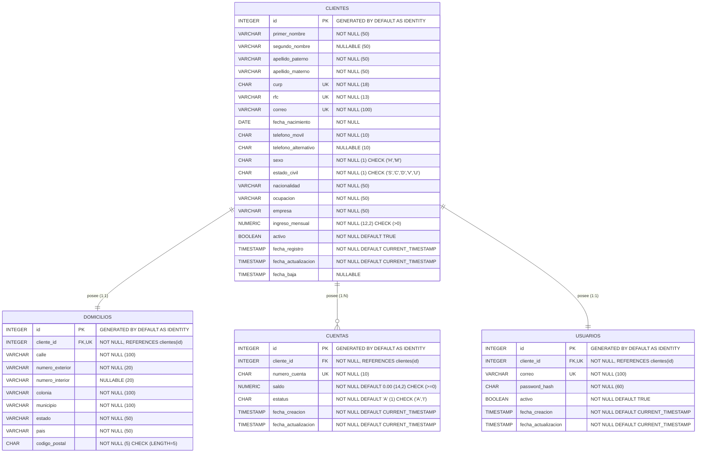

# Documento Técnico: Módulo de Onboarding de Clientes Personas Físicas

## 1. Descripción del Módulo

El módulo de **Onboarding de Clientes Personas Físicas** provee la funcionalidad para el registro, consulta, actualización y baja lógica de clientes del sistema bancario/financiero. Garantiza la integridad de los datos personales, fiscales, de domicilio, cuentas asociadas y credenciales de acceso a la plataforma mediante validaciones estrictas y mecanismos de seguridad robustos basados en Spring Security, BCrypt y JSON Web Tokens (JWT).

---

## 2. Diagrama Entidad-Relación (Mermaid `erDiagram`)



---

## 3. Decisiones de Tipos de Datos y Uso de Memoria

- **Llaves Primarias (`id`):** Se definió `INTEGER GENERATED BY DEFAULT AS IDENTITY` para ser totalmente consistente con las convenciones preexistentes del proyecto. Garantiza portabilidad entre H2 2.2+ y PostgreSQL ocupando solo 4 bytes por registro.
- **Campos de Texto Fijo y Numéricos de Teléfono/CP:**
  - `curp` (CHAR 18), `codigo_postal` (CHAR 5), `telefono_movil` y `telefono_alternativo` (CHAR 10) y `numero_cuenta` (CHAR 10) son declarados de tipo texto (`CHAR`) para garantizar la preservación de ceros a la izquierda y evitar pérdidas de precisión numéricas.
  - `password_hash` utiliza `CHAR(60)` para reservar el espacio exacto generado por los hashes de BCrypt.
- **Cadenas de Longitud Variable:** Se acotaron los campos de nombres a `VARCHAR(50)`, correos a `VARCHAR(100)` y direcciones a `VARCHAR(50/100)`, evitando el uso innecesario de `TEXT` o `VARCHAR(255)` por costumbre para optimizar las páginas de memoria de la base de datos.
- **Tipos Monetarios:** `NUMERIC(12,2)` para ingresos mensuales y `NUMERIC(14,2)` para saldos de cuentas. Se evita rigurosamente el uso de `FLOAT` o `DOUBLE` para impedir errores de redondeo de punto flotante.
- **Catálogos Compactos:** Para `sexo` ('H', 'M'), `estado_civil` ('S', 'C', 'D', 'V', 'U') y `estatus` de cuenta ('A', 'I') se emplearon caracteres compactos `CHAR(1)` reforzados con restricciones `CHECK` en SQL, los cuales se mapean en Java a `enum` mediante `AttributeConverter` de JPA.
- **Fechas y Auditoría:** `DATE` para `fecha_nacimiento` y `TIMESTAMP` para auditorías de creación, actualización y fecha de baja.

---

## 4. Índices y Restricciones (Constraints)

- **Nombres Nomenclados Explicítamente:**
  - PKs: `pk_clientes`, `pk_domicilios`, `pk_cuentas`, `pk_usuarios`
  - FKs: `fk_domicilios_cliente`, `fk_cuentas_cliente`, `fk_usuarios_cliente`
  - UQs: `uq_clientes_curp`, `uq_clientes_rfc`, `uq_clientes_correo`, `uq_domicilios_cliente`, `uq_cuentas_numero_cuenta`, `uq_usuarios_cliente`, `uq_usuarios_correo`
  - CKs: `ck_clientes_ingreso_mensual`, `ck_clientes_sexo`, `ck_clientes_curp_len`, `ck_clientes_rfc_len`, `ck_clientes_telefono_movil_len`, `ck_clientes_telefono_alternativo_len`, `ck_clientes_estado_civil`, `ck_domicilios_codigo_postal_len`, `ck_cuentas_saldo`, `ck_cuentas_numero_cuenta_len`, `ck_cuentas_estatus`
- **Índices de Rendimiento:**
  - `ix_clientes_fecha_registro`: Optimiza la búsqueda por rangos de fechas en la consulta de clientes.
  - `ix_clientes_activo`: Optimiza los listados de clientes activos.
  - `ix_cuentas_estatus`: Acelera el filtrado de cuentas activas.
  - `ix_cuentas_cliente_id`: Optimiza la resolución de relaciones entre clientes y cuentas.

---

## 5. Arquitectura por Capas

El módulo sigue una arquitectura multicapa desacoplada:
1. **Controladores REST (`controller`):** Reciben peticiones HTTP, validan los DTOs de entrada y retornan las respuestas JSON adecuadas.
2. **Servicios de Negocio (`service` & `service/Impl`):** Contienen las reglas de negocio, lógica transaccional (`@Transactional`), generación de cuentas y gestión de seguridad.
3. **Repositorios JPA (`repositorys/onboarding`):** Interfaces Spring Data JPA declaradas en `ConfigDB.java`.
4. **Entidades de Dominio (`entity/onboarding`):** Clases JPA auditadas con `@PrePersist` y `@PreUpdate`.
5. **DTOs y Validaciones (`model/onboarding` & `validation`):** Request/Response DTOs aislados con Bean Validation y validadores custom (`@MayorDeEdad`, `@PasswordSegura`).
6. **Mapeadores (`mapper`):** Mapeo de objetos mediante MapStruct (`ClienteMapper`).
7. **Excepciones (`exception`):** Jerarquía desacoplada manejada centralizadamente por `GlobalExceptionHandler`.

---

## 6. Matriz de Endpoints REST

| Método | Endpoint | Autenticación Requerida | Códigos HTTP | Descripción |
| :--- | :--- | :--- | :--- | :--- |
| **POST** | `/clientes` | Pública | 201, 400, 409 | Registro completo de cliente personas físicas. |
| **GET** | `/clientes` | Autenticada | 200, 400, 401 | Consulta clientes con filtros `?activo=&fechaDesde=&fechaHasta=`. |
| **GET** | `/clientes/{id}` | Autenticada | 200, 401, 404 | Consulta cliente por ID. |
| **GET** | `/clientes/curp/{curp}` | Autenticada | 200, 401, 404 | Consulta cliente por CURP. |
| **GET** | `/clientes/rfc/{rfc}` | Autenticada | 200, 401, 404 | Consulta cliente por RFC. |
| **GET** | `/clientes/cuenta/{numeroCuenta}` | Autenticada | 200, 401, 404 | Consulta cliente dueño del número de cuenta. |
| **GET** | `/clientes/correo` | Autenticada | 200, 401, 404 | Consulta cliente por correo electrónico (`?correo=...`). |
| **PUT** | `/clientes/{id}` | Autenticada | 200, 400, 401, 404, 409 | Actualización de cliente. |
| **DELETE** | `/clientes/{id}` | Autenticada | 204, 401, 404 | Baja lógica del cliente, cuentas y usuario. |
| **GET** | `/cuentas/{numeroCuenta}` | Autenticada | 200, 401, 404 | Consulta de cuenta por número. |
| **GET** | `/cuentas` | Autenticada | 200, 401 | Lista de cuentas por estatus (`?estatus=ACTIVA`). |
| **GET** | `/cuentas/{numeroCuenta}/saldo` | Autenticada | 200, 401, 404 | Consulta de saldo de cuenta. |
| **POST** | `/auth/login` | Pública | 200, 400, 401, 403 | Inicio de sesión y generación de token JWT. |
| **GET** | `/usuarios/{id}` | Autenticada | 200, 401, 403, 404 | Consulta de datos del propio usuario. |
| **PUT** | `/usuarios/{id}/password` | Autenticada | 204, 400, 401, 403, 404 | Cambio de contraseña del propio usuario. |

---

## 7. Mapeo de Reglas de Negocio y Validaciones

| Regla / Validación | Ubicación de Implementación | Comportamiento / Manejo |
| :--- | :--- | :--- |
| **Validación de Mayoría de Edad (18 años)** | `MayorDeEdadValidator.java` | Compara `fechaNacimiento.plusYears(18)` contra `LocalDate.now()`. Quien cumple 18 hoy sí cuenta. |
| **Complejidad de Contraseña** | `PasswordSeguraValidator.java` | Exige 8+ caracteres, mayúscula, minúscula, número y carácter especial. |
| **Normalización de Datos** | `ClienteServiceImpl.java` | Convierte CURP y RFC a mayúsculas, correo a minúsculas. |
| **Unicidad de Registro (CURP/RFC/Correo)** | `ClienteServiceImpl.java` | Valida existencia previa devolviendo `409 CONFLICT` (`CurpDuplicadaException`, `RfcDuplicadoException`, `CorreoDuplicadoException`). |
| **Generación de Cuenta Única** | `ClienteServiceImpl.java` | Genera número de 10 dígitos mediante `SecureRandom` con bucle de reintentos y respaldo por `UNIQUE`. |
| **Saldo Inicial Configurable** | `application.properties` & `ClienteServiceImpl.java` | Toma el saldo de `onboarding.cuenta.saldo-inicial` (por defecto 0.00) si no se especifica. |
| **Baja Lógica Cascade** | `ClienteServiceImpl.java` | En 1 sola transacción inactiva cliente (`activo=false`, `fecha_baja`), sus cuentas (`INACTIVA`) y su usuario (`activo=false`). Operación idempotente. |
| **Imposibilidad de Modificar Datos Fiscales** | `ClienteUpdateRequest.java` | La anotación `@JsonIgnoreProperties(ignoreUnknown = false)` rechaza campos como `curp` o `rfc` devolviendo `400 BAD REQUEST`. |
| **Validación de Usuario Activo en JWT** | `JwtAuthenticationFilter.java` | Verifica en BD en cada petición que el usuario de la firma exista y esté activo; la baja lógica invalida tokens vigentes de inmediato. |
| **Seguridad de Acceso a Usuarios** | `UsuarioServiceImpl.java` | Compara el ID del usuario en el token contra el ID del recurso; si no coinciden devuelve `403 FORBIDDEN`. |

---

## 8. Seguridad y Configuración de JWT

La autenticación utiliza JSON Web Tokens (JWT) firmados con el algoritmo HMAC256.

### Variables de Entorno y Claves Secretas
- Propiedad de configuración: `jwt.secret=${JWT_SECRET:}`
- Expiración predeterminada: `jwt.expiration-ms=3600000` (1 hora).
- **Instrucción de Configuración en PowerShell:**
  ```powershell
  $env:JWT_SECRET="ClaveSuperSeguraYSecretaDeAlMenos32BytesDeLongitud2026!"
  ```
- **Mecanismo de Respaldo:** Si la variable `JWT_SECRET` está vacía al arrancar la aplicación, se genera una clave aleatoria temporal de 32 bytes y se emite una advertencia en el log (sin exponer la clave). Si la clave está configurada, exige un mínimo de 32 bytes.

---

## 9. Limitaciones Conocidas

1. **Ausencia de Control de Roles Granular (RBAC):** Todos los usuarios autenticados del sistema tienen permiso para realizar consultas generales de clientes y cuentas.
2. **Preservación de Rutas Públicas Legacy:** Para no alterar la retrocompatibilidad con entregas anteriores, los endpoints `/personas`, `/personasActualiza`, `/personasElimina` y `/gestopago/**` continúan configurados como públicos en `SecurityConfig.java`.
